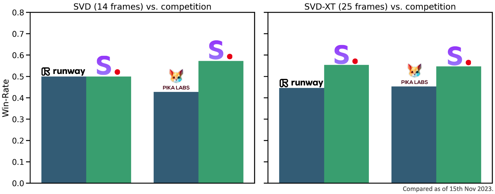

---
#型号卡片元数据参考见规范：https://github.com/huggingface/hub-docs/blob/main/modelcard.md?plain=1
#文件/指南： https://huggingface.co/docs/hub/model-cards
{}
---

#稳定视频扩散图像到视频模型卡

<！ --提供模型功能的快速摘要。 -->

稳定视频扩散(SVD)图像到视频(Image-to-Video)是一种扩散模型，它将静止图像作为调节帧，并从中生成视频。

##模型详细信息

###型号说明

(SVD)图像到视频(Image-to-Video)是一种潜在扩散模型，其被训练为从图像调节生成短视频剪辑。
该模型被训练为生成分辨率为576x1024的25帧，给定相同大小的上下文帧，从[SVD图像到视频微调[14帧]](https://huggingface.co/stabilityai/stable-video-diffusion-img2vid).
我们还微调了广泛使用的[F8-译码器](https://huggingface.co/docs/diffusers/api/models/autoencoderkl#从原始格式加载)为了时间的一致性。
为方便起见，我们还为模型提供了
标准逐帧译码器[在这里](https://huggingface.co/stabilityai/stable-video-diffusion-img2vid-xt/blob/main/svd_xt_image_decoder.safetensors).

-**编制单位：**稳定性AI
-**资金来源：**稳定性AI
-**型号类型：**生成图像到视频模型
-**根据模型进行微调：**SVD图像到视频[14帧]

###模型源

出于研究目的，我们建议`生成模型`GitHub存储库(https://github.com/Stability-AI/generative-models),
它实现了最流行的传播框架(训练和推理)。

-**存储库：** https://github.com/Stability-AI/generative-models
-**纸：** https://stability.ai/research/stable-video-diffusion-scaling-latent-video-diffusion-models-to-large-datasets

##评价

上图评估了用户对SVD-图像到视频的偏好，而不是[GEN-2](https://research.runwayml.com/gen2)和[PikaLabs](https://www.pika.art/).[GEN-2](https://research.runwayml.com/gen2)和[PikaLabs](https://www.pika.art/).
就视频质量而言，SVD-图像到视频是人类选民的首选。 有关用户研究的详情，请参阅[研究文件](https://stability.ai/research/stable-video-diffusion-scaling-latent-video-diffusion-models-to-large-datasets)[研究论文](https://stability.ai/research/stable-video-diffusion-scaling-latent-video-diffusion-models-to-large-datasets)

##uses

###直接使用

该模型仅用于研究目的。 可能的研究领域和任务包括

--研究生成模型。
--安全部署可能产生有害内容的模型。
--探索和理解生成模型的局限性和偏差。
--艺术品的产生和在设计和其他艺术过程中的使用。
--在教育或创意工具中的应用。

排除的用途描述如下。

###超出范围使用

模型并没有被训练成真实或真实的人或事件的表现，
因此，使用该模型来生成这样的内容超出了该模型的能力的范围。
该模型不得以任何违反稳定性AI[可接受使用政策]的方式使用(https://stability.ai/use-policy).[可接受的使用政策](https://stability.ai/use-policy).

##限制和偏差

###限制
--生成的视频相当短(<=4sec)，模型没有达到完美的照片真实感。
--模型可能生成没有运动的视频，或者生成速度非常慢的摄像盘。
--无法通过文本控制模型。
--模型无法呈现清晰可见的文本。
--面部和一般人物可能无法正确生成。
--模型的自动编码部分有损耗。

###推荐

该模型仅用于研究目的。

##如何开始使用模型

结帐https://github.com/Stability-AI/generative-models

